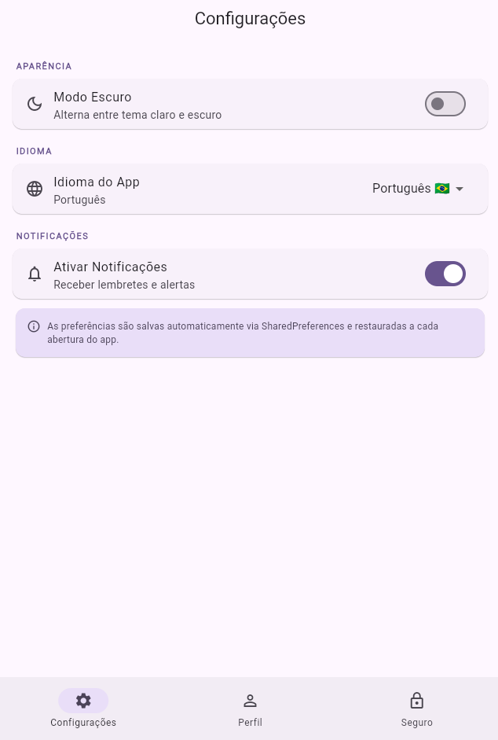
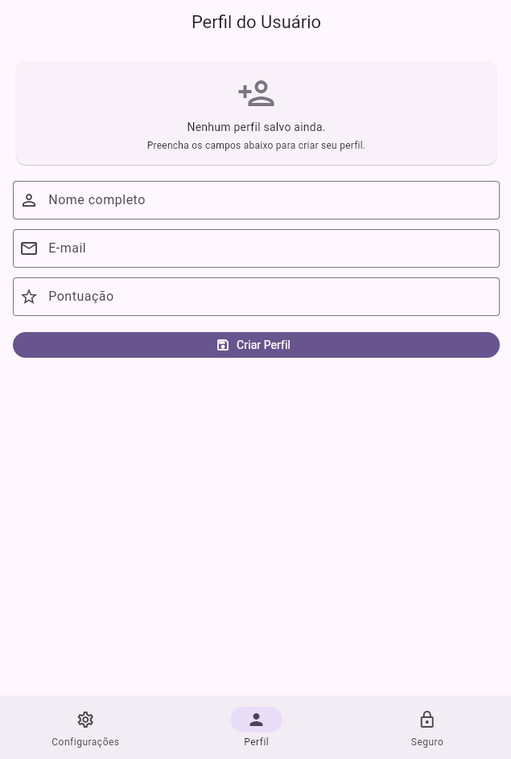
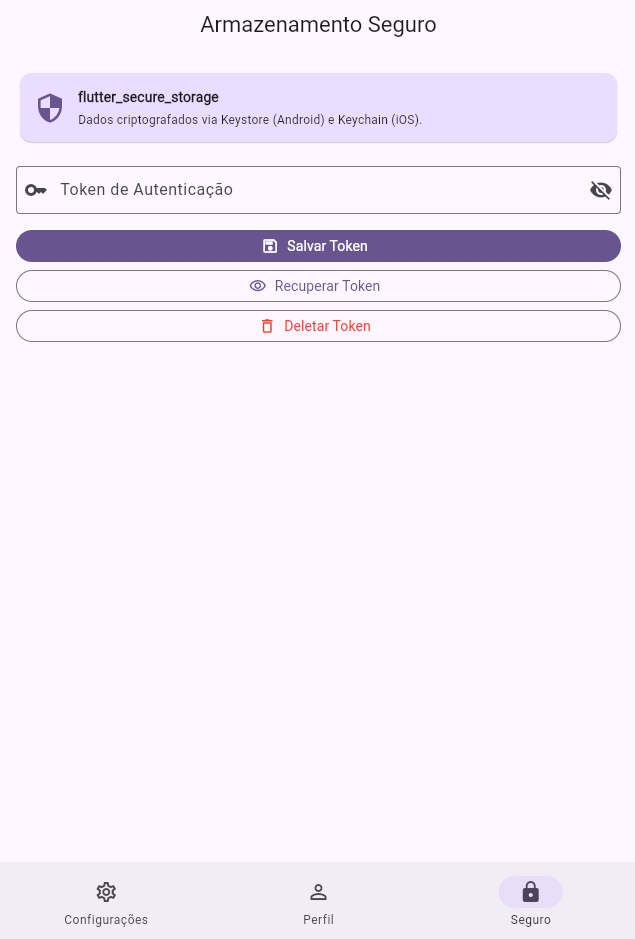

# LocalVault — Armazenamento Local com SharedPreferences, Hive e flutter_secure_storage

Este é um projeto prático desenvolvido para a disciplina de Desenvolvimento para Dispositivos Móveis. O objetivo da atividade é demonstrar o uso de diferentes estratégias de persistência de dados local em Flutter, aplicando boas práticas de privacidade conforme a LGPD.

## Aluno

* **Nome:** Felipe Gabriel Schmitt
* **Turma:** 5ª Fase — Análise e Desenvolvimento de Sistemas 2026/1 — Faculdade Senac Joinville

---

## Funcionalidades implementadas

### Tela de Configurações — SharedPreferences
- **Toggle de modo escuro/claro** — persiste entre sessões e aplica o tema globalmente via Provider
- **Seletor de idioma** — Português / English, salvo e restaurado automaticamente
- **Toggle de notificações** — preferência armazenada e carregada ao abrir o app
- **SettingsService como ChangeNotifier** — mudanças refletem na UI em tempo real sem rebuild manual

### Perfil do Usuário — Hive
- **Modelo `UserProfile`** com 4 campos (`nome`, `email`, `dataCadastro`, `pontuacao`) anotados com `@HiveType` e `@HiveField`
- **TypeAdapter gerado** pelo build_runner (`user_profile.g.dart`) para serialização binária eficiente
- **Formulário com validação** para criação e edição do perfil
- **ValueListenableBuilder** — UI reativa que atualiza automaticamente ao salvar/excluir
- **Botão "Excluir Dados"** — implementa o direito ao esquecimento (LGPD, art. 18), remove o perfil completamente do box Hive

### Armazenamento Seguro — flutter_secure_storage
- **Salvar token** — grava o token criptografado via Keystore (Android) / Keychain (iOS)
- **Recuperar token** — lê e exibe o token salvo na tela
- **Deletar token** — remove o token do armazenamento seguro
- **Campo com toggle de visibilidade** — oculta/exibe o conteúdo do token

### Migração de Dados — Bônus
- **MigrationService** detecta se o app está na versão 1 (chaves avulsas no SharedPreferences)
- Migra automaticamente `user_name` e `user_email` para um `UserProfile` no Hive
- Registra a versão atual dos dados na chave `data_version` do SharedPreferences

---

## Screenshots do projeto

### 1. Tela de Configurações — SharedPreferences


### 2. Perfil do Usuário — Hive com TypeAdapter


### 3. Armazenamento Seguro — flutter_secure_storage


---

## Estrutura do projeto

```
lib/
├── main.dart
├── models/
│   ├── user_profile.dart
│   └── user_profile.g.dart
├── services/
│   ├── storage_service.dart
│   ├── settings_service.dart
│   └── secure_storage_service.dart
├── migration/
│   └── migration_service.dart
└── screens/
    ├── home_screen.dart
    ├── settings_screen.dart
    ├── profile_screen.dart
    └── secure_screen.dart
```

---

## Como executar o projeto

Siga as instruções abaixo para rodar o projeto localmente em sua máquina.

### Pré-requisitos

Certifique-se de ter o [Flutter SDK](https://flutter.dev/docs/get-started/install) instalado e configurado corretamente no seu ambiente.

### Passos

1. Clone este repositório:
```bash
git clone https://github.com/Felipe-G-Schmitt/localvault.git
```

2. Acesse a pasta do projeto:
```bash
cd localvault
```

3. Instale as dependências do projeto:
```bash
flutter pub get
```

4. Execute o aplicativo:
```bash
flutter run
```
